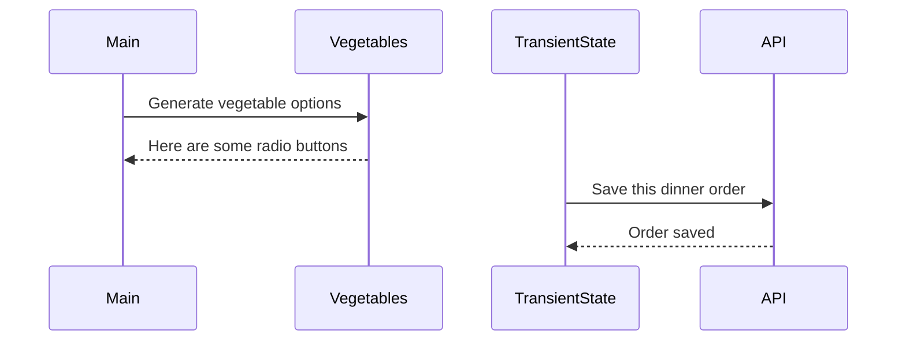

# Events and State Self-Assessment

> 🧨 Make sure you answer the vocabulary and understanding questions at the end of this document before notifying your coaches that you are done with the project

## Setup

1. Make sure you are in your `workspace` directory
1. `git clone {github repo SSH string}`
1. `cd` into the directory it creates
1. `code .` to open the project code
1. Use the `serve` command to start the web server
1. Open the URL provided in Chrome

## Requirements

### Initial Render

1. All 10 base dishes should be displayed as radio input options.
1. All 9 vegetables should be displayed as radio input options.
1. All 6 side dishes should be displayed as radio input options.
1. All previously purchases meals should be displayed below the meal options. Each purchase should display the primary key and the total cost of the purchased meal.

### State Management

1. When the user selects an item in any of the three columns, the choice should be stored as transient state.
1. When a user makes a choice for all three kinds of food, and then clicks the "Purchase Combo" button, a new sales object should be...
    1. Stored as permanent state in your local API.
    1. Represented as HTML below the **Monthly Sales** header in the following format **_exactly_**. Your output will not have zeroes, but the actual amount.
        ```html
        Receipt #1 = $00.00
        ```
   1. The user's choices should be cleared from transient state once the purchase is made.

## Design

Given the description and animation above...

1. Create an ERD for this application before you begin.
1. Make a list of what modules need to be created to make your application as modular as possible. Create a **Dependency Graph** for the project to be reviewed once you are complete with the assessment.
1. Create a **Sequence Diagram** that visualizes what your algorithm is for this project. We'll give you a minimal starting point.



## Vocabulary and Understanding

> 🧨 Before you click the "Assessment Complete" button on the Learning Platform, add your answers below for each question and make a commit. It is your option to request a face-to-face meeting with a coach for a vocabulary review.

1. Should transient state be represented in a database diagram? Why, or why not?
   > A database diagram is a visual representation of a database's structure. A database holds permanent data. Transient state data is temporary data. So no it should not be stored in a database or represented in a database diagram.
   >It should be a part of the sequence diagram or maybe a more detailed version of the user story that describes what is supposed to happen when a user interacts with the page.
   > If someone wanted to permanently store the click or change events that happened before the submit/save button then it wouldn't be called transient state. 
2. In the **FoodTruck** module, you are **await**ing the invocation of all of the component functions _(e.g. sales, veggie options, etc.)_. Why must you use the `await` keyword there? Explain what happens if you remove it.
   > If you removed the await from the functions in FoodTruck.js it would come back as undefined, because the functions did not have the time to fetch the data from the api server. the undefined error results from the promise not being resolved yet.
3. When the user is making choices by selecting radio buttons, explain how that data is retained so that the **Purchase Combo** button works correctly.
   > When the user interacts with a 'radio' input, an eventListener is triggered. The event listener invokes a function that captures the data and converts it into an integer so that it is compatible to be temporarily stored in a transient state variable as a key value pair in an array. The data stays stored in that variable until the user interacts with the button that sends the data to the api server and then it clears out the temporary transient data.
4. You used the `map()` array method in the self assessment _(at least, you should have since it is a learning objective)_. Explain why that function is helpful as a replacement for a `for..of` loop.
   > The .map method is a good replacement in these types of situations because we are trying to pull a couple key value pairs out of each object in the array. It makes a more concise easier to read code. It allows it to be placed inside of template literals so that we can be more precise in the data we render on the page.
